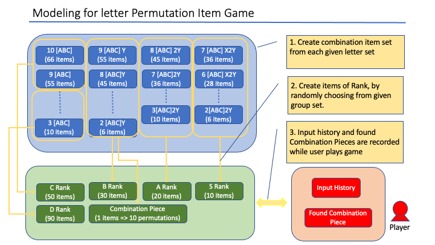

# Definition of Item Rank:
This defines the length and composition of letters for each rank item.
Except for "Combination Pieces", each item should have unique letter combination from others,
in order to make sure that not causing any item duplication when reshuffle event occurs.
- S Rank (10):  
  5-10 letter, including X and 2Y
- A Rank (20):  
  5-10 letter, including 2Y
- B Rank (30):  
  3-10 letter including 1Y
- C Rank (50):  
  7-10 letter, only ABC
- D Rank (90):  
  3-8 letter, only ABC
- Combination Pieces (10):  
  10 letter including 1Y

# System Architecture
The chart shows data model of this system.

1) the combination item set from given letters will be created by "createLetterCombinationSet" method in ItemUtils Class. (Using recursive logic to make it general use.)
2) Item rank definition has flexibility on letter length. By specifying the letter length range, system will randomly pick up item for given Rank from item sets created in (1).
3) Once all rank items are created, system can offer game play mode, which interact with player.

# How to execute
Please execute Main class with Java. (Verified working on JDK16)
This is the process flow after execution.
1) Set up D rank item
2) Set up C rank item
3) Set up B rank item
4) Set up A rank item
5) Set up S rank item
6) Set up "Combination Pieces" item
7) Start Game Mode

## Source code explanation
Role of each java class in this system
1) Main  
  Starting point of system execution. Initialize GameController class and provide command-line interfaces to users. 

2) GameController  
  Record user input history during the game and trigger the reshuffle event when 10 "Combination Pieces" are found.

3) ItemRankConfiguration  
  Data class generating initial ItemSet of each rank to follow the given definition 
and managing the operations related to those "ItemSet" and "Combination Pieces".

4) ItemSet  
  Data class stored item set of "combination" and "permutation" respectively.
  "combination" set is used when initially generating item set to avoid having duplicated combination item.

5) ItemUtils  
  Utility class providing the general useful function such as shuffling letter of String.

6) ItemLetter  
  Define a letter as constant variable to avoid hardcode typing.

## Reference
This is the reference material used for defining each rank above.
Considered the number of unique combination for given length of String in case compositing 3 common letters "A, B, C".  

10=> 12C10= 66  
9=> 11C9= 55  
8=> 10C8= 45  
7=> 9C7= 36  
6=> 8C6= 28  
5=> 7C5= 21  
4=> 6C4= 15  
3=> 5C3= 10  

